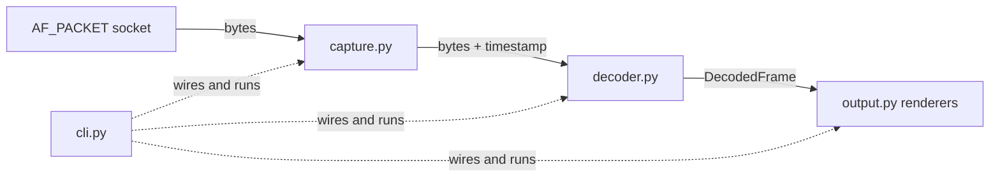

# How Packet Sniffer works

A guided tour of the application for contributors and the curious. The
protocol parsing itself lives in the
[NETProtocols](https://github.com/EONRaider/NETProtocols) library
(which has [its own tour](https://github.com/EONRaider/NETProtocols/blob/master/ARCHITECTURE.md));
this document covers everything around it: capturing, orchestrating,
rendering, and staying alive for hours.

## The pipeline

One frame flows through four stages, each owned by one module:



- **[`capture.py`](src/packet_sniffer/capture.py)** opens a raw
  `AF_PACKET` socket (every EtherType, one interface or all) and
  yields `(bytes, timestamp)` pairs forever.
- **[`decoder.py`](src/packet_sniffer/decoder.py)** turns one frame's
  bytes into a `DecodedFrame` — a pure function with no state between
  calls.
- **[`frame.py`](src/packet_sniffer/frame.py)** defines `DecodedFrame`:
  frozen, slotted, self-contained.
- **[`output.py`](src/packet_sniffer/output.py)** renders frames;
  renderers dispatch on decoded layer types.
- **[`cli.py`](src/packet_sniffer/cli.py)** parses arguments, prints
  privilege guidance, and runs the loop.

## Why root, and why Linux-only

Ordinary sockets hand applications payloads; this tool wants whole
Ethernet frames, headers included, before the kernel's protocol stack
processes them. That is exactly what Linux's `AF_PACKET` socket family
provides — and it is Linux-only and privileged. Root works, and so
does the finer-grained alternative:

```
sudo setcap cap_net_raw+ep .venv/bin/python   # then run unprivileged
```

`PF_PACKET` is imported in exactly one module, `capture.py`, and
`cli.py` imports that module lazily. Everything else works with plain
bytes — which is why the entire test suite runs without root, without
Linux, and without a network.

## The frame lifecycle, and why memory stays flat

A capture session may run for hours at thousands of frames per second,
so the memory story is engineered, not accidental:

1. `capture()` yields **one freshly allocated, immutable `bytes`
   object per frame** — never a reused buffer. Nothing that happens
   later can be corrupted by the next `recv`.
2. `decode_frame()` wraps it in a `memoryview` so walking the layers
   slices without copying; every value it *keeps* (fields, options,
   payload) is materialized. The view dies with the function call.
3. The resulting `DecodedFrame` is **immutable and self-contained**:
   no references to sockets or capture buffers. An earlier design
   reused one mutable decoder object per capture; any consumer that
   kept a frame saw it silently change under them. Never again.
4. The loop in `cli.run()` holds only the current frame. The moment it
   moves on, the previous frame's reference count hits zero and CPython
   frees it — no accumulation, no garbage-collection pressure, flat
   RSS regardless of capture duration.

The capture buffer is 65,550 bytes: a maximum-size IP datagram behind
an Ethernet header. The loopback interface routinely carries frames
far larger than any physical MTU, so a smaller buffer (the old
implementation used 9,000) silently truncates local traffic.

## Surviving the real network

Real interfaces deliver runt frames, exotic EtherTypes, and datagrams
cut short by the capture itself. The decoder treats all of it as data,
not as exceptions to die on:

- **Unknown protocol?** The library's `next_protocol()` returns
  `None`, the chain ends, and the remaining bytes become the frame's
  payload. An LLDP or VLAN-tagged frame renders as Ethernet plus
  payload instead of an error.
- **Malformed header?** The library raises a typed `ProtocolError`
  (truncated buffer, lying length field). `decode_frame()` catches it,
  keeps the layers that did decode, and records the diagnostic on
  `frame.error`. The capture continues.
- **Truncated datagram?** If the IP layer declares more bytes than
  were captured, `frame.truncated` is set and the renderer says so.

## Rendering

`OutputToScreen._render` is a `singledispatchmethod`: registering a
renderer for a layer type is one decorated method, and layers without
a renderer fall back to a generic line instead of crashing. Renderers
receive the **whole frame**, not just their layer — the ICMP renderer
prints the enclosing IP addresses via `frame.layer(IPv4)`, context a
layer-only API could not provide. (The previous implementation
dispatched on method-name strings; one typo'd property name meant
every IPv6 frame crashed the display. Type dispatch plus the library's
graceful display properties removed that class of bug.)

Adding an output is deliberately boring:

```python
class OutputToNDJSON(Output):
    def update(self, frame: DecodedFrame) -> None:
        print(json.dumps({"n": frame.number, "len": frame.length, ...}))
```

Instantiate it in `cli.main()` alongside `OutputToScreen` and every
frame reaches both.

## Testing without root

Test fixtures build frames with netprotocols' *encode* path (real
header values in, exact wire bytes out) and feed them straight to
`decode_frame()` — no socket in sight. The suite covers each
protocol stack, payload offsets with TCP options present, unknown
EtherTypes, truncation diagnostics, and buffer-aliasing regressions.

```
uv sync         # resolves netprotocols from ../NETProtocols during development
uv run pytest
uv run mypy && uv run ruff check
```

CI runs those gates on Python 3.12–3.14, checking out NETProtocols
beside this repository until netprotocols 1.0.0 is published to PyPI.
