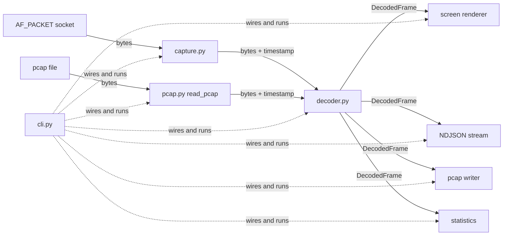

# How RootWire works

A guided tour of the application for contributors and the curious. The
protocol parsing itself lives in the
[NETProtocols](https://github.com/EONRaider/NETProtocols) library
(which has [its own tour](https://github.com/EONRaider/NETProtocols/blob/master/ARCHITECTURE.md));
this document covers everything around it: capturing, replaying,
orchestrating, rendering, and staying alive for hours.

## The pipeline

One frame flows from a source, through the decoder, to every output:



- **[`capture.py`](src/rootwire/capture.py)** opens a raw `AF_PACKET`
  socket (every EtherType, one interface or all) and yields
  `(bytes, timestamp)` pairs forever.
- **[`pcap.py`](src/rootwire/pcap.py)** reads and writes classic pcap,
  dependency-free. `read_pcap()` deliberately has **the same shape as
  `capture()`**, so `-r FILE` is a drop-in frame source — the whole
  pipeline runs against a file, no privileges needed. The reader
  handles both byte orders and nanosecond-precision files, and refuses
  non-Ethernet linktypes (nothing else can be fed to an Ethernet
  decoder).
- **[`decoder.py`](src/rootwire/decoder.py)** turns one frame's bytes
  into a `DecodedFrame` — a pure function with no state between calls.
- **[`frame.py`](src/rootwire/frame.py)** defines `DecodedFrame`:
  frozen, slotted, self-contained — including `raw`, the exact
  captured bytes (the same object the decoder received, so keeping it
  costs no copy; it is what the pcap writer emits).
- **[`output.py`](src/rootwire/output.py)** holds every consumer
  behind one small `Output` interface: the screen renderer, the NDJSON
  stream, the pcap writer, and the statistics collector.
- **[`cli.py`](src/rootwire/cli.py)** parses arguments, picks the
  source, assembles the outputs, and runs the loop.

## Why root, and why Linux-only

Ordinary sockets hand applications payloads; this tool wants whole
Ethernet frames, headers included, before the kernel's protocol stack
processes them. That is exactly what Linux's `AF_PACKET` socket family
provides — and it is Linux-only and privileged. Root works, and so
does the finer-grained alternative:

```
sudo setcap cap_net_raw+ep .venv/bin/python   # then run unprivileged
```

`PF_PACKET` is imported in exactly one module, `capture.py`, and
`cli.py` imports that module lazily — replaying a file with `-r` never
touches it. Everything else works with plain bytes, which is why the
entire test suite runs without root, without Linux, and without a
network.

## The frame lifecycle, and why memory stays flat

A capture session may run for hours at thousands of frames per second,
so the memory story is engineered, not accidental:

1. `capture()` yields **one freshly allocated, immutable `bytes`
   object per frame** — never a reused buffer. Nothing that happens
   later can be corrupted by the next `recv`.
2. `decode_frame()` wraps it in a `memoryview` so walking the layers
   slices without copying; every value it *keeps* (fields, options,
   payload) is materialized, and `frame.raw` simply holds the original
   object. The view dies with the function call.
3. The resulting `DecodedFrame` is **immutable and self-contained**:
   no references to sockets or capture buffers. An earlier design
   reused one mutable decoder object per capture; any consumer that
   kept a frame saw it silently change under them. Never again.
4. The loop in `cli.run()` holds only the current frame. The moment it
   moves on, the previous frame's reference count hits zero and CPython
   frees it — no accumulation, no garbage-collection pressure, flat
   RSS regardless of capture duration.

The capture buffer is 65,550 bytes: a maximum-size IP datagram behind
an Ethernet header. The loopback interface routinely carries frames
far larger than any physical MTU, so a smaller buffer (an old
implementation used 9,000) silently truncates local traffic.

## Surviving the real network

Real interfaces deliver runt frames, exotic EtherTypes, datagrams cut
short by the capture itself — and, if someone is being creative,
deliberately hostile input. The decoder treats all of it as data, not
as exceptions to die on:

- **Unknown protocol?** The library's `next_protocol()` returns
  `None`, the chain ends, and the remaining bytes become the frame's
  payload. An LLDP or VLAN-tagged frame renders as Ethernet plus
  payload instead of an error.
- **Malformed header?** The library raises a typed `ProtocolError`
  (truncated buffer, lying length field). `decode_frame()` catches it,
  keeps the layers that did decode, and records the diagnostic on
  `frame.error`. The capture continues.
- **Truncated datagram?** If the IP layer declares more bytes than
  were captured, `frame.truncated` is set and the renderer says so.
- **Crafted amplification?** The decode chain is capped at 16 layers
  per frame. IPv6 extension headers chain legitimately (an MLD report
  is `Ethernet / IPv6 / Hop-by-Hop / ICMPv6`), but a 65,535-byte frame
  of back-to-back 8-byte extension headers would otherwise decode
  ~8,100 layer objects. Past the cap, the frame is diagnosed and the
  capture moves on.

## Outputs

Every consumer implements one interface — `update(frame)` per frame,
plus an optional `close()` for resources at end of capture:

- **`OutputToScreen`** renders indented text. `_render` is a
  `singledispatchmethod`: registering a renderer for a layer type is
  one decorated method, and layers without one fall back to a generic
  line instead of crashing. Renderers receive the **whole frame**, not
  just their layer — the ICMP renderer prints the enclosing IP
  addresses via `frame.layer(IPv4)`, context a layer-only API could
  not provide. (A previous implementation dispatched on method-name
  strings; one typo'd property name crashed the display on every IPv6
  frame. Type dispatch removed that class of bug.)
- **`OutputToNDJSON`** (`--json`) prints one JSON object per frame:
  layer fields straight from the dataclasses, bytes hex-encoded, one
  line each, flushed. stdout carries *nothing else* — the banner, the
  statistics, and the abort notice all live on stderr — so
  `rootwire --json -r file.pcap | jq .` consumes cleanly.
- **`OutputToPcap`** (`-w`) writes `frame.raw` byte-exactly with its
  capture timestamp; the files open in Wireshark and tcpdump.
- **`StatsCollector`** tallies frames, bytes, malformed and truncated
  counts, and per-protocol totals bucketed by the innermost decoded
  layer among TCP/UDP/ICMPv4/ICMPv6/ARP (an extension-header or
  non-first-fragment ending counts as `other`). The report — with
  duration and frames/s — lands on stderr at Ctrl-C or replay
  end-of-file.

They compose freely: `sudo rootwire -i eth0 -w evidence.pcap --json`
renders NDJSON to stdout while archiving every frame to disk.

## Testing without root

The suite runs recorded traffic, not sockets. Its backbone is a
**65-frame corpus of real captured frames** (12 scenarios — see
[tests/fixtures/MANIFEST.md](tests/fixtures/MANIFEST.md)) shared with
the NETProtocols repository, where every frame's checksums were
verified before being committed. Corpus tests drive each frame through
decode *and* render; the pcap tests replay every corpus file through
`read_pcap` and cross-validate it against an independent reader; the
rest covers payload offsets with TCP options, unknown EtherTypes,
truncation diagnostics, fragment labeling, NDJSON schema and stdout
purity, statistics bucketing, and buffer-aliasing regressions.

```
uv sync
uv run pytest
uv run mypy && uv run ruff check
```

CI runs those gates on Python 3.12–3.14; the library dependency
resolves from PyPI like any other.
