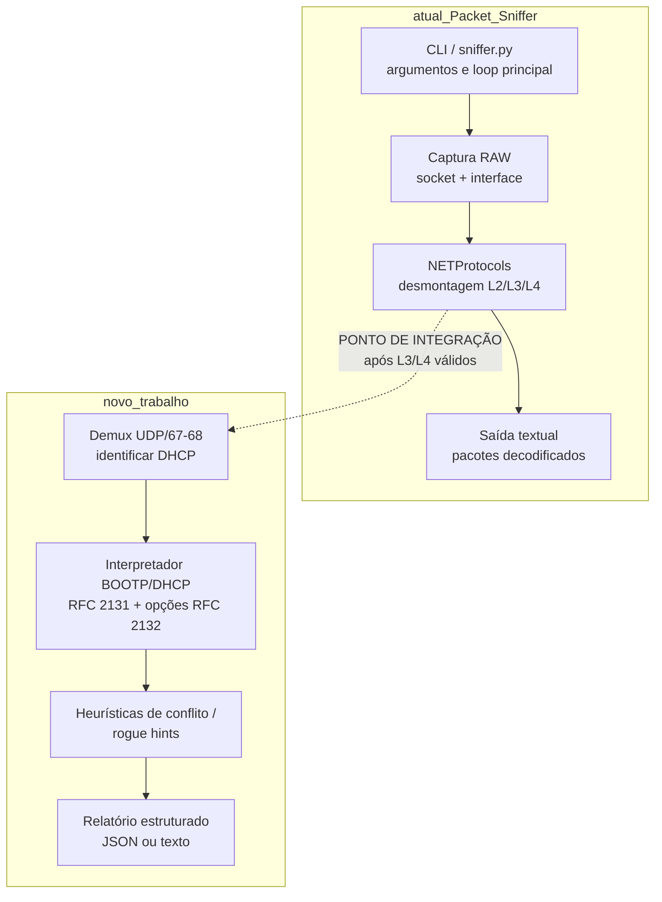

# Entrega 1 — Definição do software e da funcionalidade (Proposta)

**Disciplina:** CIC4005 — Redes de Computadores (Turma A)  
**Docente:** Maria de Fátima *(ajustar se necessário)*  
**Acadêmicos:** Gabriel Vieira, Rafael Graunke  
**Data de elaboração:** 10/04/2026  

Este documento segue o roteiro da **Entrega 1** (PDF 1–2 páginas) e serve como base para conversão em PDF.

---

## 1) Identificação do software

| Campo | Conteúdo |
|--------|-----------|
| **Nome** | **Packet Sniffer** (repositório: `Packet-Sniffer`) |
| **Repositório oficial (fonte principal)** | https://github.com/EONRaider/Packet-Sniffer |
| **Licença** | **GNU Affero General Public License v3.0** (**AGPL-3.0**) — software livre (copyleft). Arquivo: https://github.com/EONRaider/Packet-Sniffer/blob/master/LICENSE |
| **Dependência relevante (mesmo autor)** | **NETProtocols** — implementações de baixo nível de protocolos comuns em Python 3: https://github.com/EONRaider/NETProtocols *(repositório complementar; o trabalho parte do `Packet-Sniffer` como software principal escolhido)* |

**Justificativa da escolha (administração / segurança de redes):** ferramenta de **inspeção de tráfego** em Python, alinhada a diagnóstico e segurança em redes IP; permite estender o sniffer com **análise semântica** de protocolos de infraestrutura (neste trabalho, **DHCP**), útil para detectar **conflitos** ou **comportamento anômalo** em LANs.

---

## 2) Descrição do software (com evidência)

### Finalidade e principais funcionalidades

O **Packet-Sniffer** é uma ferramenta de **captura e exibição** de pacotes em **Python 3**, usando **socket RAW** em GNU/Linux. Os pacotes são **desmontados** (“disassembled”) à medida que chegam na interface de rede e as informações são apresentadas no terminal. A partir da versão 2.0.0, o projeto depende da biblioteca **NETProtocols** para a desmontagem em camadas.

### Linguagens / tecnologias

- **Python 3.8+**
- **Socket RAW** (`socket.SOCK_RAW`) — exige privilégios elevados (ex.: `sudo`) em captura ao vivo, conforme o README oficial.
- **NETProtocols** (dependência declarada no README do repositório oficial).

### Ano de início / marco inicial do repositório

- **Criação do repositório no GitHub:** **2020-11-17** (metadado público `created_at` da API do GitHub).

### Última atualização (evidência)

- **Último push no branch padrão (`master`):** **2025-09-10** (metadado público `pushed_at` em 10/04/2026).  
- **Referência para comprovação (commits / atividade):** https://github.com/EONRaider/Packet-Sniffer/commits/master  

*(Na versão em PDF, recomenda-se anexar captura de tela da página de commits ou do cabeçalho do repositório com a data do último push.)*

---

## 3) Diagrama técnico do software (obrigatório)

Diagrama de **módulos** com o **ponto de integração** da nova funcionalidade (marcado).

**Leitura do diagrama:** hoje o fluxo é **captura → desmontagem → impressão**. A integração proposta **acopla** um pipeline adicional quando o quadro for **IPv4/UDP** com portas **67/68**, aplicando **interpretação própria** do payload **BOOTP/DHCP** e gerando **alertas/relatório** — sem substituir a saída existente por “dump opaco” de terceiros.

---

## 4) Funcionalidade proposta (obrigatória e detalhada)

### Título do recurso

**Auditoria de DHCP “suspeito” a partir de captura** — extração de campos **BOOTP/DHCP** e detecção de **indícios de conflito** (ex.: múltiplos servidores / parâmetros divergentes).

### Objetivo e motivação

Em redes locais, o **DHCP** define endereço IP, **gateway**, **DNS** e tempo de concessão. Um **segundo servidor DHCP** (não autorizado) ou respostas **inconsistentes** podem indicar **misconfiguração** ou **risco de redirecionamento** de tráfego. O recurso apoia **administração e segurança** ao transformar bytes de captura em **campos interpretados** e **sinais objetivos** de anomalia.

### Requisitos funcionais (o que o recurso fará)

1. **Entrada**
   - **Mínimo obrigatório (MVP):** arquivo **`.pcap` / `.pcapng`** *(leitura de frames; demultiplexação Ethernet → IPv4 → UDP pode usar biblioteca auxiliar apenas para **acesso a camadas**, mantendo a **interpretação DHCP implementada pelo grupo**)*.
   - **Extensão opcional:** integração no modo **ao vivo** do `Packet-Sniffer`, reutilizando o buffer já desmontado até UDP.

2. **Interpretação de cabeçalhos (obrigatório para o trabalho final)**
   - **Ethernet:** MAC destino/origem; **EtherType** `0x0800` (IPv4) *(com nota de escopo: VLAN 802.1Q pode ficar fora do MVP)*.
   - **IPv4:** versão, IHL, protocolo = UDP, endereços origem/destino, comprimentos coerentes.
   - **UDP:** portas 67/68, comprimento do segmento.
   - **BOOTP/DHCP (RFC 2131):** `op`, `htype`, `hlen`, `xid`, `flags`, `ciaddr`, `yiaddr`, `siaddr`, `giaddr`, `chaddr` (MAC do cliente), **magic cookie** `0x63825363`.
   - **Opções DHCP (RFC 2132):** parsing TLV com foco mínimo em **53 (DHCP Message Type)**, **54 (Server Identifier)**, **51 (Lease Time)**, **1 (Mask)**, **3 (Router)**, **6 (DNS)**; fim em **255 (End)**.

3. **Saída**
   - Registro por transação/evento com **campos nomeados** e valores interpretados (humanos).
   - **Relatório de alertas** com justificativa baseada em **regras** (abaixo), citando **quais campos** dispararam o alerta.

4. **Heurísticas iniciais (exemplos verificáveis)**

   - **H1 — Múltiplos servidores prováveis:** mais de um par **(Server Identifier opção 54)** e/ou **MAC de origem Ethernet** distinto respondendo com **OFFER/ACK** em janela de observação *(definir janela T no relatório técnico final)*.
   - **H2 — Parâmetros críticos divergentes:** para o mesmo “contexto” observado (ex.: mesma sub-rede inferida ou mesmo fluxo de descoberta), **Router (3)** ou **DNS (6)** **inconsistentes** entre respostas.
   - **H3 — Inconsistências estruturais:** payload truncado, `hlen` incompatível com `chaddr`, cookie inválido, opções malformadas — reportar como **erro de parse** (robustez).

### Limitações previstas (explicitar na proposta)

- Escopo **DHCPv4 clássico** (UDP/67–68). **DHCPv6 fica fora.**
- Cenários com **relay** (`giaddr` ≠ 0) e opções específicas de agente podem exigir **fase 2**; no MVP documentar **comportamento conservador** (ex.: alertas marcados como “inconclusivos sob relay”).
- **802.1Q (VLAN)** pode exigir deslocamento de offsets; no MVP pode-se **restringir** a PCAPs Ethernet IPv4 “simples” ou documentar suporte incremental.
- Captura ao vivo continua sujeita a **ética/permissões**; testes preferenciais com PCAP de laboratório.

### Entrada / saída esperada (formato)

| Aspecto | Especificação proposta |
|--------|-------------------------|
| **Entrada** | Caminho para `captura.pcap` *(MVP)*; opcionalmente interface ao vivo. |
| **Saída** | Texto estruturado e/ou **JSON** com lista de mensagens DHCP parseadas + lista de alertas *(cada alerta: regra, severidade, evidências: xid, MACs, opções, IPs)*. |

### Protocolos / cabeçalhos interpretados (lista fechada para aprovação)

| Camada | Protocolo | Campos principais a interpretar |
|--------|-----------|----------------------------------|
| Enlace | Ethernet II | Dst MAC, Src MAC, EtherType |
| Rede | IPv4 | IHL, proto, src, dst, total length |
| Transporte | UDP | src port, dst port, length |
| Aplicação/infra | BOOTP/DHCP | op, htype, hlen, xid, flags, addrs, chaddr, cookie + **opções** 53/54/51/1/3/6 |

### O que será alterado / criado no software (nível alto)

| Tipo | Artefato sugerido | Papel |
|------|-------------------|--------|
| **Novo** | `dhcp_parser.py` (nome ilustrativo) | Parser BOOTP + loop de opções DHCP com validações. |
| **Novo** | `dhcp_alerts.py` | Regras H1–H3 e agregação temporal. |
| **Novo** | `pcap_reader.py` *(se necessário)* | Leitura de PCAP e entrega de frames brutos ao pipeline. |
| **Novo** | testes + PCAPs de laboratório | Evidência de validação (comparar com Wireshark). |
| **Alterado** | CLI principal (`sniffer.py` / pacote `packet_sniffer`) | Novo modo, ex.: `--dhcp-audit arquivo.pcap` ou subcomando equivalente. |
| **Alterado** | `README.md` | Instalação, exemplo de execução, limitações, aviso legal de uso autorizado. |

### Publicação (conforme enunciado do trabalho final)

- **Fork público** no GitHub/GitLab mantendo **compatibilidade de licença** com **AGPL-3.0**.
- **Pull Request opcional** ao repositório original, se a comunidade aceitar o escopo; caso contrário, manter **fork documentado** + instruções claras (também atende publicação em repositório público).

### Referências normativas (para a documentação técnica e validação)

- RFC 2131 — *Dynamic Host Configuration Protocol*  
- RFC 2132 — *DHCP Options and BOOTP Vendor Extensions*  
- IEEE 802.3 — Ethernet *(campos de enquadramento consultivos para o MVP)*  

### Validação (alinhado ao roteiro de documentação final)

- Comparar **campo a campo** com **Wireshark** (`dhcp` / `udp.port == 67 || udp.port == 68`) em pelo menos **dois** PCAPs: um “limpo” e outro com **conflito simulado** (dois servidores / respostas divergentes).

---

## Observação de conformidade com o enunciado

- A funcionalidade **não** se resume a listar bytes nem a repassar saída pronta de ferramenta: o grupo implementará **interpretação explícita** dos campos BOOTP/DHCP e das **opções**, usando esses campos nas **heurísticas** e no **relatório**.
- A captura/arquivo pode usar biblioteca para **acesso a frames**, desde que a **lógica central** do trabalho seja a **decodificação e o uso semântico** dos cabeçalhos listados acima.

---

## Nota legal / ética (laboratório)

O uso de sniffers deve ocorrer **somente** em redes/laboratórios **autorizados**, com **consentimento** e em conformidade com políticas locais. O repositório base já contém **avisos legais**; o fork manterá postura equivalente.
